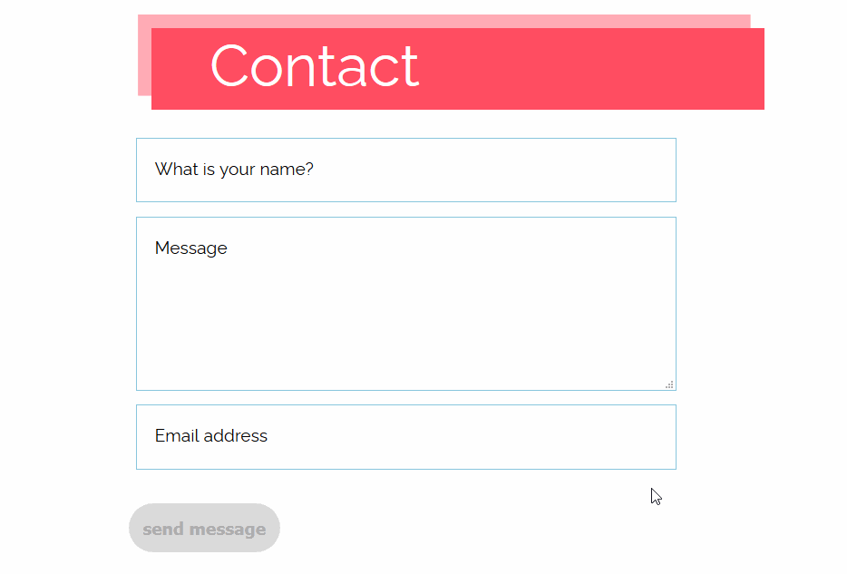

# Browser Technologies

[](https://kager.io/contact/)
[https://kager.io/contact/](https://kager.io/contact/)

## Core functionality

A contact form with progressively enhanced validation features. The validation rules are defined in the HTML template.

The front-end has two layers of validation:

- Basic HTML5 validation
- Javascript validation enhancements

The back-end has one layer of validation:

- Validation rules parsed from the HTML5 template (cached for optimal performance)

The javascript validations on the front-end enhance the User Experience by showing validation feedback without re-rendering the page. It also provides visual improvements to the standard HTML5 validation feedback.

When JavaScript is not available the back-end provides a fallback.

### Relevant files

The contact form is part of my personal website, the repository can be found here:

[Github - web design](https://github.com/baskager/web-design)

| File | Description
| - | - |
| `/app/views/partials/forms/contact.handlebars` | Contact form handlebars template
| `/app/src/js/contact.js` | Javascript enhancements
| `/app/src/sass/` | Styling for the contact page
| `/app/server.js` | /contact/ endpoint runtime code
| `/app/components/forms/` | Directory of custom components used for the contact form

## Why it matters

In traditional applications, the back-end and front-end validations are **separate** because each markup/programming language has their own API for validation. Usually, validation on the front-end is in place to warn the user of invalid input before actually sending the data to the back-end.

Front-end and Back-end are two disciplines and are often maintained seperately. This poses some unique risks:

- You can **never trust**  the front-end. The front-end is for **User Experience**, not for processing inputs.
  - Everything from the client-side can easily manipulated. You could probably train a monkey to do so.
  - The internet is the wild west, the end-user chooses the tooling to connect with your website (browsers, command lines, security tools etc.). Expect the unexpected.
  - [Javascript doesn't always work](https://kryogenix.org/code/browser/everyonehasjs.html)
- It is possible for front-end and back-end developers to miscommunicate.
- When mainentance is only performed on one side, it will cause side effects on the other side. In the worst-case scenario you end up with a serious vulnerability or the sofware (component) will stop working entirely.
- There can be uncalculated differences, causing vulnerabilities, in the validation API's of:
  - Browsers
  - Programming languages
  - Packages/frameworks

### Maintaining a happy, healthy relationship with javascript

The modern front-end developers' relationship with JavaScript is... unhealthy.


Modern websites rely so much on Javascript that it actually breaks on more platforms than it enhances. This is sad, and it's ridiculous. Because it is used for the most benign things. Why would you stop your entire website from working because of for example: an animation? Why gamble with excluding entire demographics when HTML5 elements can solve most of your problems already? **Progressive Enhancement** is the answer.

## Features used and research of accessibility issues

### Table 1. Analysis of supported validation features

| Feature | HTML (front-end) | Javascript (front-end) | NodeJS (Back-End)
| - | - | - | - |
| **required**                  | [x] | [x] | [x] |
| **min/max**                   | [x] | [x] | [x] |
| **email**                     | [x] | [x] | [x] |
| **SPAM protection**           | [ ] | [ ] | [x] |

### Table 2. Analysis of supported enhancements (front-end)

| Enhancement | HTML | Javascript
| - | - | - | - | - |
| Validation without page render                    | [x] | [x]
| Live validation (without clicking 'submit')       | [ ] | [x]
| Form submission without page render (AJAX)        | [ ] | [x]
| Error/success handling without page render (AJAX) | [ ] | [x]
| Automatic retry on server/network failure         | [ ] | [x]

### Javascript enhancements

HTML provides a lot of validation features already, however, the way validation features are performed are not always user friendly. In table 2 it is clear that most of the planned enhancements can not be realised with just HTML, those enhancements have to be realised through JavaScript.

Enhancements are only there to improve the User Experience. When JavaScript is not available the primary goal of the contact form (sending a mail) will not be impacted. The form itself however, will be basic.

### Custom back-end validation components

The FormMapper and Validator components were made to ensure that the back-end validation is consistent with the validation on the front-end. The FormMapper creates a JSON map of a HTML/Handlebars form, the Validator then uses this map to validate inputs.

#### The FormMapper component

The back-end should adhere to the exact same validation rules as the front-end. The FormMapper component was made to solve this problem. The constructor of the FormMapper component expects one argument, the path to a handlebars template file.

 ```javascript

const contactFormMap = new components.FormMapper(
  "views/partials/forms/contact.handlebars"
);

app.post("/contact", urlencodedParser, function(req, res) {
    contactFormMap
        .get()
        .then(map => {
            let validatedData = validator.validateInputs(map, req.body);

            if (!validatedData.isValidationError) {
                // Data is not validated, do something
            }
        }
}
 ```

The `get()` method on the FormMapper retrieves a JSON map of the form. `v-map="true"` on the HTML input element indicates that the input element should be included in the validation map.

If `v-cache="true"` is set on the form HTML element, the `get()` method will attempt to retrieve the form object through the Cache module. If no cached object is available or if the cache has not been enabled, it will generate the form map from scratch.

`v-filter="true"` is used to incidate that the input is a bot filter. These are hidden inputs in the field which should always be empty. (Bots usually fill every input element in a form).

```HTML
<input v-map="true" placeholder="What is your name?" name="name" type="text" minlength="2" maxlength="64"  value="{{validatedData.inputs.name.value}}" required/>
<textarea v-filter="true" v-map="true" class="v-filter" placeholder="Keep this field empty"  name="fltr"></textarea>
```

```javascript
{
  "FormMapper": {
    "views/partials/forms/contact.handlebars": {
      "name": "contact",
      "version": "0.1",
      "isCache": true,
      "inputs": {
        "name": {
          "name": "name",
          "type": "text",
          "min": 2,
          "max": 64,
          "placeholder": "What is your name?",
          "botFilter": false
        },
        "fltr": {
          "name": "fltr",
          "type": "textarea",
          "min": 0,
          "max": 0,
          "placeholder": "Keep this field empty",
          "botFilter": true
        }
      }
    }
  }
}
```

## The Validator component

The validator component is a wrapper for the 'validator' NPM package. The 'validateInputs()' method accepts two arguments. The validation map from the FormMapper component and the request body from an HTTP/Express POST request. 

The method returns an object with all of the validated data and the validation status.

```javascript
    const validator = new components.Validator();
    let validatedData = validator.validateInputs(map, req.body);

    if (!validatedData.isValidationError) {
        // Data is not validated, do something
    }
```

### Fallbacks

#### Detecting AJAX requests on the back-end

A custom header is sent along by the front-end code.

```javascript
xhr.setRequestHeader("xhr", "true");
```

This custom header is then searched for on the back-end. 

1. If the request was an AJAX request, render the results as JSON
2. If javascript was not available, there is no AJAX request, so the results should be rendered on the page.

```javascript
renderContactAfterFormSubmission = (req, res, data, error) => {
    let xhr = req.headers.xhr === "true";
    let status = 200;
    if (xhr) {
      res.setHeader("Content-Type", "application/json");
      data.error = error;

      // Set status codes on errors
      if (error) status = 500;
      if (data.isValidationError) status = 400;

      res.status(status).send(JSON.stringify(data));
    } else {
      res.render("contact", {
        pageName: "contact",
        meta: meta,
        validatedData: data,
        error: error
      });
    }
  };
```

The pattern described above allows the form to be used even when Javascript is not available.

## Supported browsers

When JavaScript is not available, all browsers that support basic CSS and form submission are supported.

### Support of form enhancements

| Browser | Version |
|-|-|
| **Opera mini**                | **All versions**  |
| **Microsoft Edge**            | **All versions**  |
| **Opera mobile**              | **All versions**  |
| **Chrome for Android**        | **All versions**  |
| **Firefox for Android**       | **All versions**  |
| **UC browser for Android**    | **All versions**  |
| **Samsung Internet**          | **All versions**  |
| **Internet Explorer**         | **10** or newer   |
| **Mozilla Firefox**           | **3.6** or newer  |
| **Google Chrome**             | **8** or newer    |
| **Apple Safari**              | **5.1** or newer  |
| **Opera**                     | **11.5** or newer |
| **Apple IOS Safari**          | **5** or newer    |
| **Android browser**           | **3** or newer    |

According to [caniuse](https://caniuse.com) 97.97% of web users are able to use the JavaScript enhancements.
